# Reach

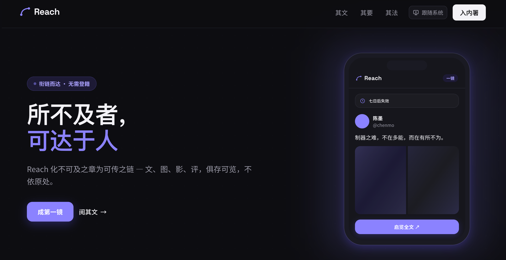

**所不及者，可达于人。**
把一条 X / YouTube 的帖子——正文、图片、视频、评论——镜像成一条可控的私密链接；也可以发布自己撰写的文章，并看见访客究竟是怎样阅读它们的。

简体中文 · [English](./README.en.md)

演示站：**https://reach.fujioky.com**

> **先部署抓取端。** Reach 不直接抓平台内容，依赖 [fujioky/reach-upstream](https://github.com/fujioky/reach-upstream) 里的代理（`proxy/`）：它在 Agent Reach 之上加了 Reach 需要的 X / YouTube 定制解析和公开访问接口。直接装上游 agent-reach 是不能用的，部署步骤见 [proxy/README.zh-CN.md](https://github.com/fujioky/reach-upstream/blob/main/proxy/README.zh-CN.md)。 视频转发 / 转存通道可部署 [fujioky/reach-dlproxy](https://github.com/fujioky/reach-dlproxy)。

---

## 预览

| | |
| --- | --- |
| 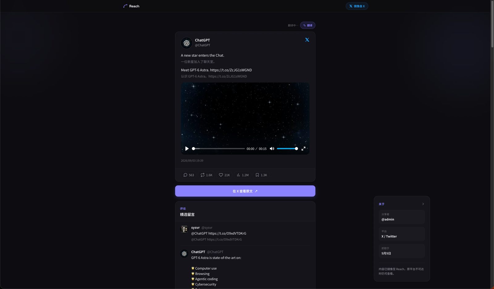 镜像页：X 帖子正文与逐段翻译、视频、互动数据、精选评论 | 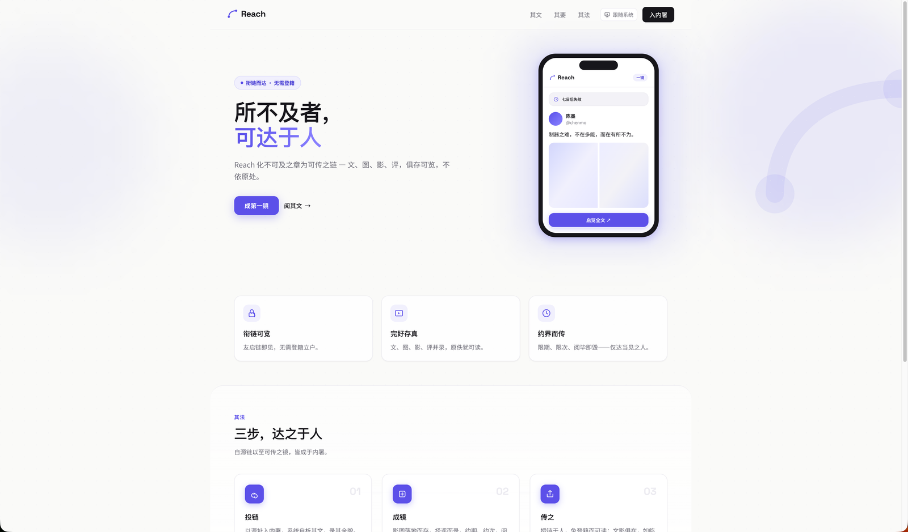 首页（浅色主题） |
| 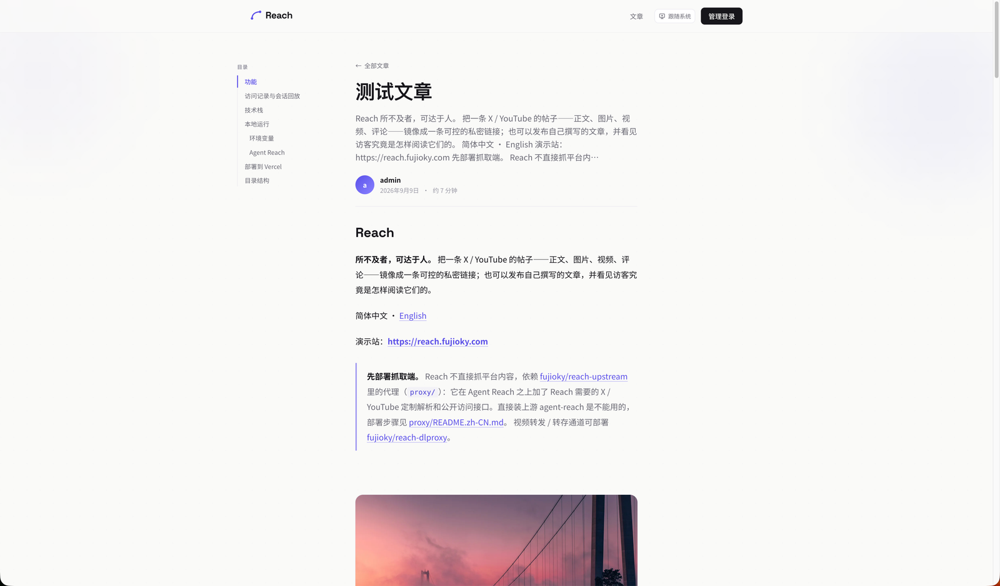 文章页：目录、阅读进度、封面与正文 | 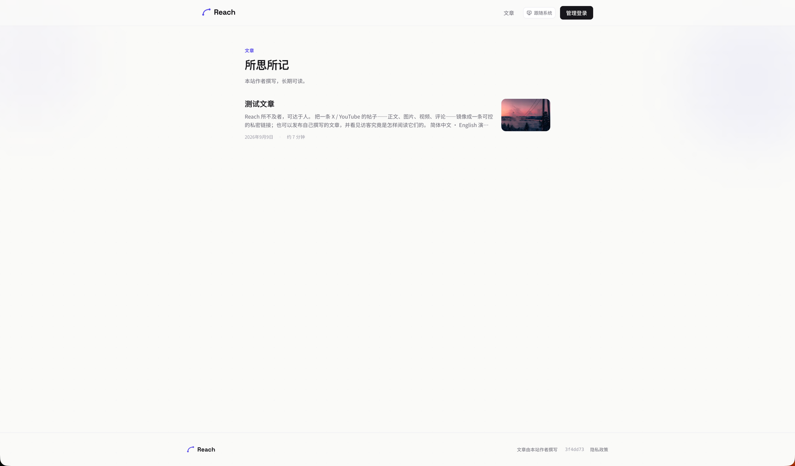 文章归档 `/post` |
| 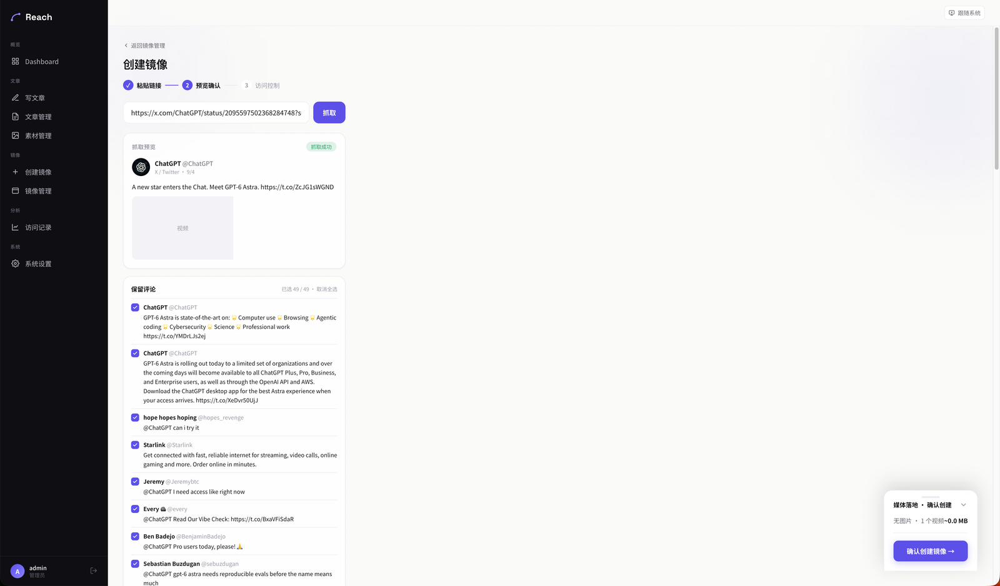 创建镜像：粘贴链接 → 抓取预览 → 勾选保留的评论 | 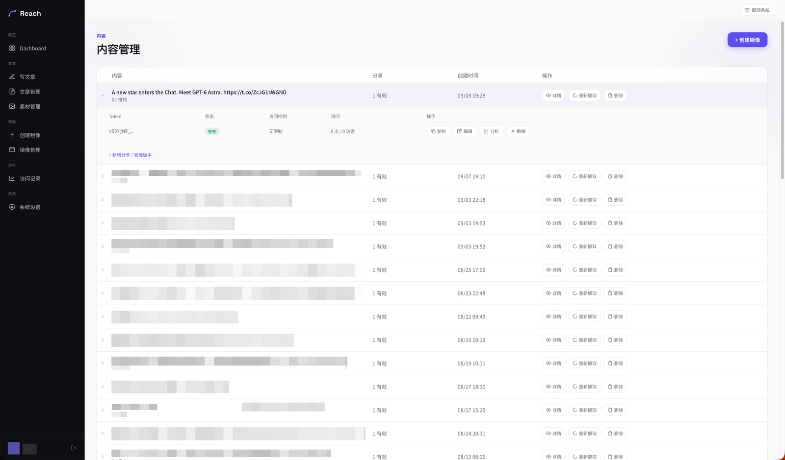 镜像管理：每条内容下的分享链接与访问统计 |
| 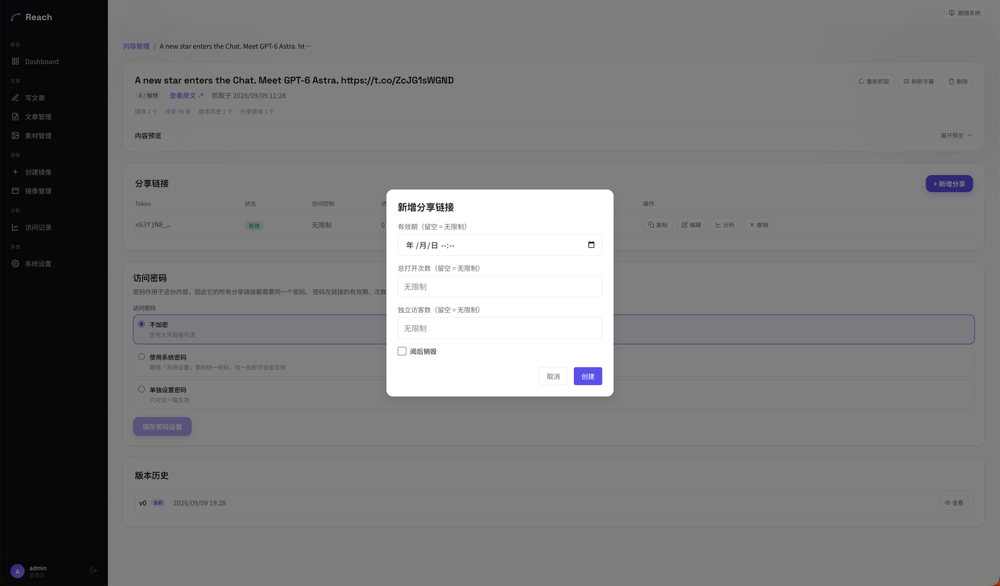 新增分享链接：有效期、总次数、独立访客数、阅后即焚 | 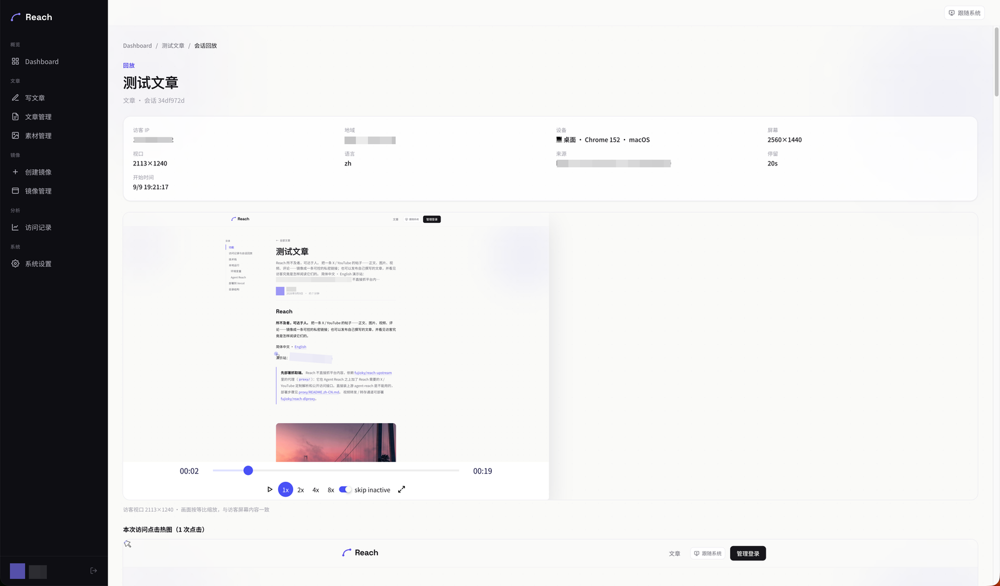 会话回放：按访客视口还原，附点击热力图 |
| 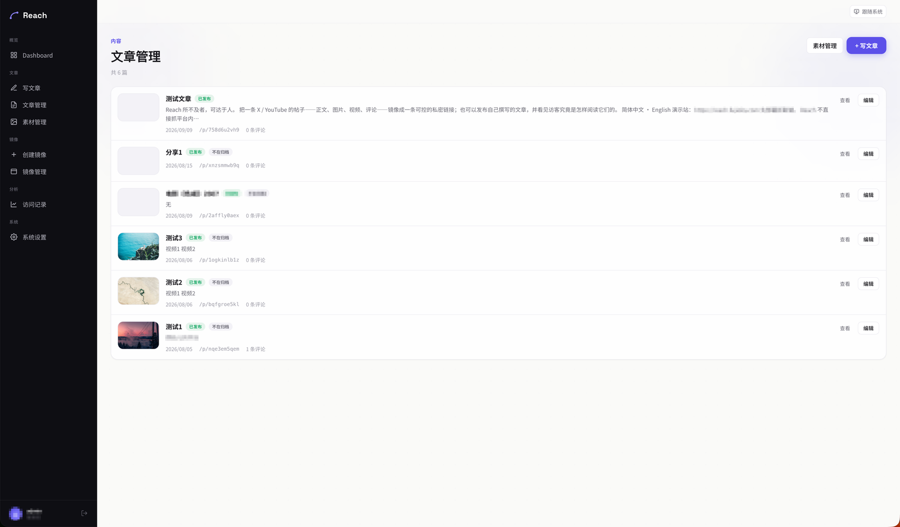 文章管理 | 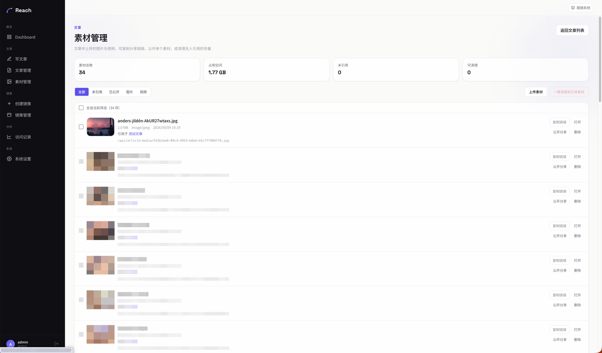 素材管理：引用状态、公开分享、清理未引用 |
| 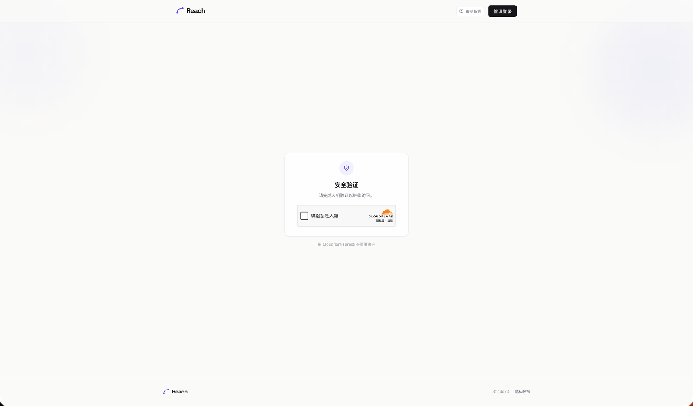 访客页的 Cloudflare Turnstile 门 | |

## 功能

**镜像** —— 贴上帖子链接，得到一份自托管副本。

- 通过上游 *Agent Reach* 接口抓取 X（Twitter）帖子与 YouTube 视频，统一归一化为同一套内容模型：标题、正文、作者、媒体、互动数据、评论。
- 视频重新托管：可经本站转发（`/api/proxy-video`）、经外部反向代理转发（参考实现 [fujioky/reach-dlproxy](https://github.com/fujioky/reach-dlproxy)），或上传到任意 S3 兼容存储桶（Cloudflare R2、AWS S3、MinIO）并从自定义域名分发。上游取流按有界分块进行，各通道之间自动故障转移。
- 分享链接（`/s/<token>`）支持限期、限次、阅后即焚。每条镜像保留版本历史，刷新前可预览差异，随时回滚。
- 字幕：播放器内直接显示最佳字幕轨，非中文字幕逐条经 DeepL 翻译；正文与评论同样按需翻译，结果缓存在数据库。

**文章** —— 用 Markdown 写自己的内容。

- 左右分栏编辑器带实时预览，拖拽 / 粘贴即上传，全站共用素材库。
- 图片存 Vercel Blob，视频经分块 multipart 直传 S3 存储桶、每块独立重试——都是浏览器直传，不经过 Serverless 函数。
- 远程转存：粘贴图片 / 视频链接（或页面地址），服务端把媒体转存到自己的存储；手写规则解析不出媒体地址时，可选用 LLM 解析器兜底。
- 公开固定链接（`/p/<slug>`）、归档页（`/post`）、访客评论与后台审核、两种封面版式、响应式 WebP 变体、逐篇密码保护。

**数据分析** —— 自建，不引入第三方脚本。

- 每个访客页面用 [rrweb](https://github.com/rrweb-io/rrweb) 录制 DOM 变化，同时采集结构化事件：浏览、分块停留时长、滚动深度、点击、媒体播放、外链点击、视频播放 / 暂停 / 拖动 / 进度。
- 后台看板：总览趋势、单条内容详情、按访客视口尺寸还原的会话回放、叠加在真实页面快照上的点击热力图。
- 上报接口无需登录，但层层设防：请求体上限、来源校验、schema 校验、内容存在性校验、按访客限流。地理位置按 IP 解析并按地址缓存。

**运维**

- 公开状态页（`/status`）带延迟迷你图，数据来自每日 cron 采样；后台健康面板探测视频代理、S3 存储桶、Agent Reach 与 DeepL。
- 访客页 Cloudflare Turnstile 人机验证门、可选的全站内容密码、PWA manifest 与 Service Worker、亮 / 暗色主题。

## 访问记录与会话回放

访客打开镜像页（`/s/<token>`）或文章页（`/p/<slug>`）时，页面会挂载一个录制器（`app/_components/analytics/Recorder.tsx`），一次打开就是一条会话。它记录三类东西：

| 类别 | 内容 | 落库 |
| --- | --- | --- |
| DOM 录像 | [rrweb](https://github.com/rrweb-io/rrweb) 的完整快照 + 增量变更；鼠标移动 60ms、滚动 150ms、媒体 800ms 采样 | `analytics_chunks`（按 `seq` 排序的 jsonb 批次） |
| 结构化事件 | `view`、`dwell`（各内容块可见时长）、`scroll`（最大深度）、`click`（页面坐标 + 文档/视口尺寸）、`media_click`、`media_play`、`outlink_click`、`video`（播放 / 暂停 / 拖动 / 每 10% 进度 / 全屏 / 结束 / 倍速） | `visit_events` |
| 会话元数据 | IP、User-Agent、屏幕与视口尺寸、DPR、语言、来源页、按 IP 解析并缓存的国家 / 地区 / 城市、累计时长与事件计数 | `analytics_sessions` |

录制器每 5 秒把缓冲批量发到 `/api/analytics/ingest`，缓冲超过 400 条 rrweb 事件时提前发送；页面关闭时用 `sendBeacon` 做最后一次提交，失败的批次留在发件箱下次重试，会话元数据在被确认前随每批重发，上报接口的写入是幂等的。视频事件在 document 捕获阶段统一采集，任何 `<video>`（含 Plyr）都能覆盖，不用给播放器埋点。

后台能看到的：

- **`/admin/analytics/sessions`** —— 会话列表（时间、内容、地区、设备、时长、事件数）。
- **`/admin/analytics/session/<id>`** —— 会话回放：rrweb-player 按访客当时的视口尺寸还原，旁边是行为时间轴；回放里的视频与录像进度同步。
- **`/admin/analytics/content/<id>/heatmap`** —— 点击热力图：取一条真实会话的录像渲染出页面快照，把该内容全部会话的点击叠上去，按桌面 / 移动视口分桶。
- **`/admin/analytics/content/<id>`** —— 单条内容的统计：趋势、分块停留、滚动深度漏斗、视频进度漏斗与暂停位置、点击目标、媒体与外链图表。

几点要知道的：

- 文章媒体地址带 6 小时签名令牌，录像里记下的是访客当时的 URL；回放接口下发前会重签令牌（`lib/analytics/resign-media.ts`），所以旧会话的图片与视频照常显示，存储的数据不动。
- 上报接口无需登录，但有请求体上限、来源校验、schema 校验、内容存在性校验、按访客限流。访客靠 HttpOnly 的 `visitor_id` cookie 区分。
- 录像**不打码**输入框（`maskAllInputs: false`），访客在评论框里输入的内容会进入录像。
- 没有关闭录制的开关，也没有自动清理：录像随内容项级联删除，长期运行要留意 `analytics_chunks` 的体积。`app/privacy-policy` 页面的文案要与你实际的采集范围保持一致。

## 技术栈

| 层 | 选型 |
| --- | --- |
| 框架 | Next.js 16（App Router，Turbopack）、React 19、TypeScript |
| 样式 | Tailwind CSS 4，自定义设计令牌（`/design-system`） |
| 数据库 | PostgreSQL + Drizzle ORM（生产环境用 Neon / Vercel Postgres） |
| 认证 | Auth.js v5 Credentials 提供者、bcrypt、JWT 会话 |
| 存储 | Vercel Blob（图片）、任意 S3 兼容存储桶（视频） |
| 媒体 | Plyr 播放器、sharp 生成图片变体、rrweb / rrweb-player 回放 |
| 图表 | Recharts |
| 测试 | Vitest |

## 本地运行

前置条件：Node.js 24、一个 PostgreSQL 数据库、一个 Vercel Blob 存储、一个 Agent Reach 接口（见下文）。

```bash
git clone https://github.com/fujioky/reach.git
cd reach
npm install
cp .env.local.example .env.local   # 填入 POSTGRES_URL、AUTH_SECRET、BLOB_READ_WRITE_TOKEN、AGENT_REACH_*
npm run db:migrate
npm run dev
```

打开 `http://localhost:3000/admin/login`。用户表为空时，登录页会变成一次性的初始化表单，创建唯一的管理员账号。其余配置——视频代理、S3 存储桶、DeepL 密钥、AI 解析器、内容密码——都在运行时于 **后台 → 系统设置** 中完成。

运行测试：`npm test`。

### 环境变量

| 变量 | 必需 | 用途 |
| --- | --- | --- |
| `POSTGRES_URL` | 是 | Postgres 连接串（`drizzle-kit` 也用它） |
| `AUTH_SECRET` | 是 | Auth.js 密钥（`openssl rand -base64 32`） |
| `BLOB_READ_WRITE_TOKEN` | 是 | Vercel Blob 令牌，存图片与头像 |
| `AGENT_REACH_BASE_URL` | 是* | 上游 Agent Reach 接口地址 |
| `AGENT_REACH_PWD` | 是* | 上游 Agent Reach 口令 |
| `NEXT_PUBLIC_SITE_URL` | 否 | 站点规范源：分享链接、OpenGraph、分析上报来源校验；缺省取 Vercel 生产域名 |
| `CRON_SECRET` | 否 | 保护 `/api/cron/*`；Vercel 定时任务会自动带上 |
| `AI_PARSER_API_KEY` | 否 | 可选 LLM 媒体解析器的密钥 |
| `TURNSTILE_SITE_KEY` / `TURNSTILE_SECRET_KEY` | 否 | 开启访客页的 Cloudflare Turnstile 门；两者留空即关闭 |

\* 也可以在后台设置中填写；环境变量优先级更高。

### Agent Reach

Reach 自身不抓取平台内容，而是调用一个封装了 [Agent Reach](https://github.com/Panniantong/agent-reach) 工具链的 HTTP 服务。直接部署上游是**不够**的：上游是给 AI Agent 用的本地能力层，没有任何包装 API。请部署 **[fujioky/reach-upstream](https://github.com/fujioky/reach-upstream)** 里的代理（`proxy/`，见其 [README](https://github.com/fujioky/reach-upstream/blob/main/proxy/README.zh-CN.md)）。它加入了 Reach 依赖的 X/Twitter 与 YouTube 定制解析——统一内容结构、全部渐进式 YouTube 视频源、带时间轴的 VTT 字幕、回复串、结构化错误类型——并把工具链通过下面这个接口和一个带 OAuth 的 MCP 服务（可接入 ChatGPT / Claude 连接器）公开出去：

```
GET {base}/healthz                                   → { "ok": true, ... }
GET {base}/http/?platform=x|youtube&query=<url>&pwd=<pwd>
                                                     → { "ok": true, "item": { ... }, "errors": [] }
```

`item` 包含帖子正文、作者、媒体（YouTube 附带全部 yt-dlp 视频源）、互动数据、评论，以及可选的 `transcript` / `transcript_lang` / `transcript_vtt` 字段。`lib/fetcher/platforms/` 中的适配器负责归一化，错误类型映射见 `lib/fetcher/errors.ts`。限流（429）与网络错误会按指数退避重试。

## 部署到 Vercel

1. 从本仓库创建 Vercel 项目（框架预设 Next.js，Node 24）。
2. 挂载一个 Postgres 数据库（Vercel 市场里的 Neon 开箱即用）和一个 Blob 存储；Vercel 会自动注入 `POSTGRES_URL` 与 `BLOB_READ_WRITE_TOKEN`。
3. 添加 `AUTH_SECRET`、`AGENT_REACH_BASE_URL`、`AGENT_REACH_PWD`，按需添加 `NEXT_PUBLIC_SITE_URL` 与 Turnstile 密钥。
4. 对生产数据库执行一次迁移：`POSTGRES_URL=... npm run db:migrate`。
5. 部署。`vercel.json` 已配置每日健康采样的 cron。
6. 访问 `/admin/login` 创建管理员账号，然后填写视频代理 / 存储设置。

`vercel` CLI 上传的是工作目录而非 git 提交；`.vercelignore` 负责把本地缓存和媒体文件排除在外。

## 目录结构

```
app/
  admin/(shell)/      后台：镜像、分享、文章、素材、分析、设置
  admin/login/        登录与首次初始化
  api/                路由处理器：抓取、视频代理、文章媒体、分析上报、健康检查、cron……
  s/[token]/          镜像访客页
  p/[slug]/, post/    文章页与归档页
  status/             公开状态页
lib/
  fetcher/            Agent Reach 客户端与平台适配器（X、YouTube）
  video/              分块上游取流、代理故障转移、播放地址解析
  storage/, blob/     S3 multipart 与预签名、Vercel Blob 辅助
  article/            Markdown、素材库、远程转存（含 SSRF 防护）、签名令牌
  analytics/          聚合查询、地理位置、回放媒体重签
  access/, content/   分享访问控制、密码门
  health/, settings/  健康探测、app_settings 类型化访问层
drizzle/migrations/   SQL 迁移（drizzle-kit）
```

`AGENTS.md` 汇总了改代码时需要知道的非显性行为与陷阱；`docs/article-publishing.md` 详细记录了文章发布链路。
